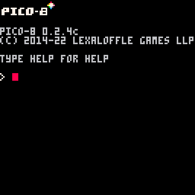
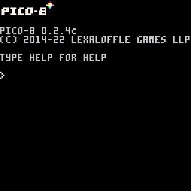
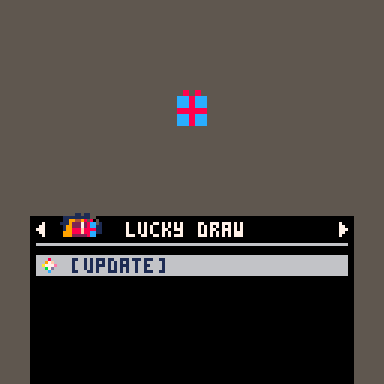
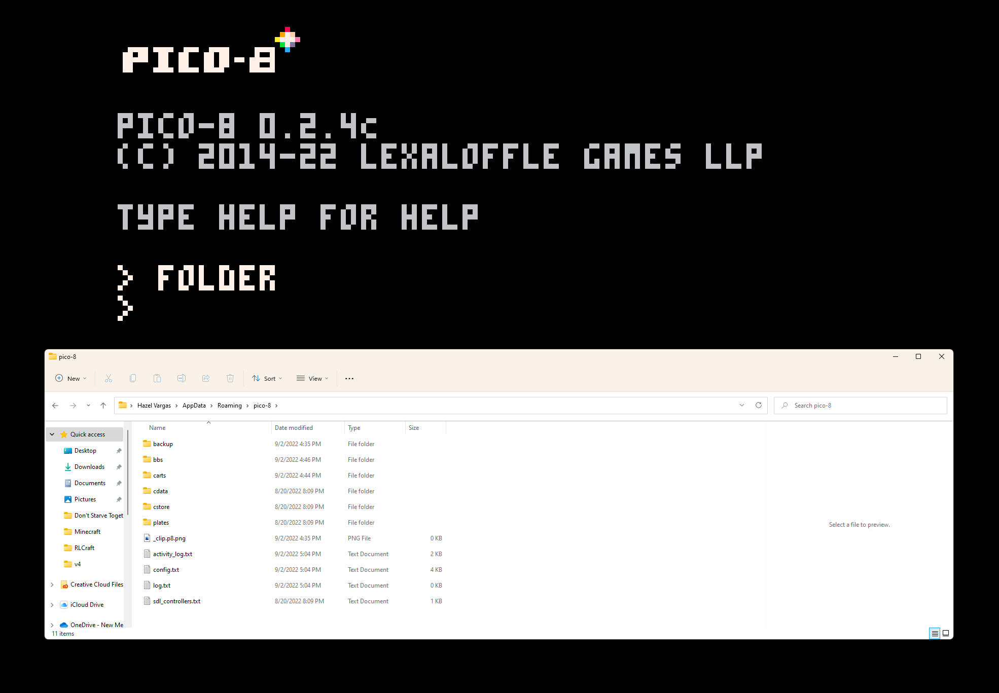

# Hello PICO-8!
It's so nice to meet you!

> Loving the ease-of-use when it comes to downloading and running (CTRL-R) a pre-existing game from Lexaloffle's catalogue! Just need an #ID and I'm ready to go!

> Just one CTRL-C and CTRL-V and I've got an entire Chess game on my device!

> Hello! This is my first experience with LUA or any subset of it, and it looks rather neat to work with; less verbose than what I'm used to!

> So many unique and colorful games! Can't wait to ex-SPLORE the rest of it on my own free time!

> Now I know where to look to begin using an external editor!